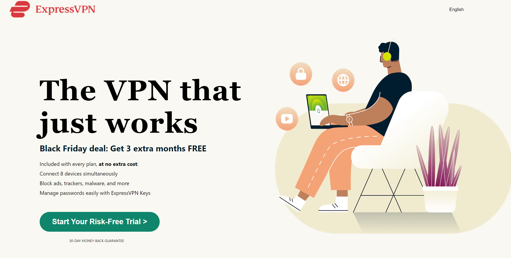

*README*

Remake of ExpressVPN Webpage

This project is a faithful recreation of the ExpressVPN webpage, aiming to replicate its design while providing a learning opportunity for web development enthusiasts.
The purpose of this project is to demonstrate proficiency in web development skills, including HTML and CSS, by recreating a complex webpage from a real-world example.
Technologies Used:
HTML: The structure of the webpage is defined using HTML (Hypertext Markup Language).
CSS: Cascading Style Sheets (CSS) are utilized for styling and layout purposes, ensuring a visually appealing and consistent presentation.
Responsive Design: CSS media queries are employed to ensure the webpage adapts gracefully to different screen sizes and resolutions.

